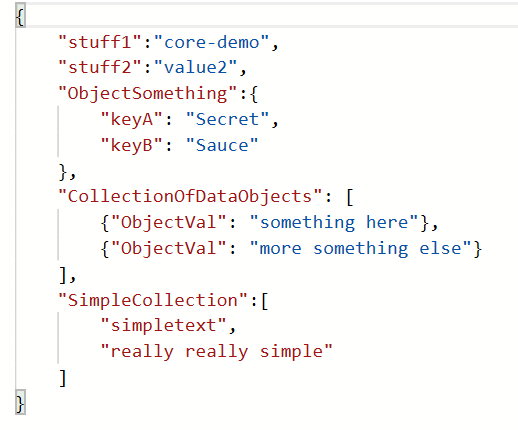
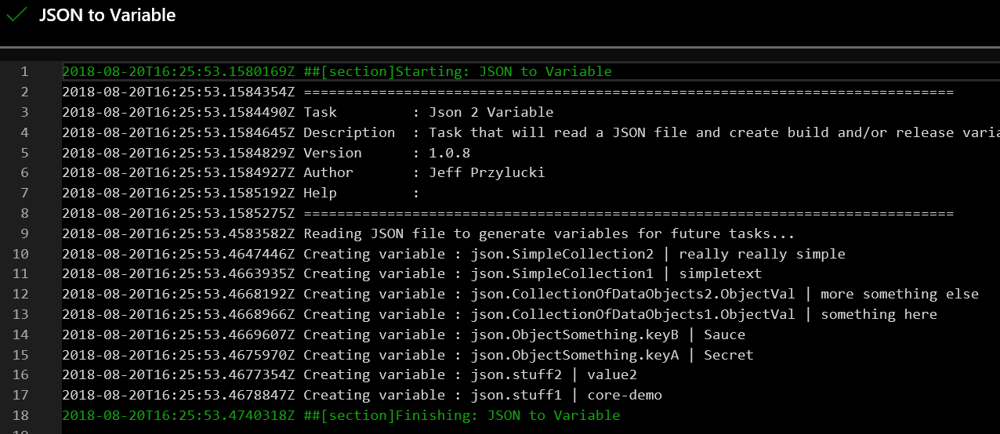

# JSON to Variable
TFS and VSTS build and release task that will read a JSON file (not JSON data from an api) and generate build and release variables to be used by other tasks in the build or release process.

This gives you the ability to read JSON files available at build or release time, the files can be something located on the File system available to build or release agents, or can be something read in from the Build source code, or in the build Artifact at release time. 

This means you can create some specific logic in your builds or releases based on the conditions based on JSON that is in Source control. 

Some uses might be to
* Release to a specific development sub-environment, giving developers some control at coding time
* Handling some versioning process through variables
* Extending agent specific conditions to your release process

NOTE -- with great power comes great responsibility, think through the implications of using this for what you are doing, just because you "Can" do something, doesn't always mean it's the "Right" choice.

## Functionality
This task reads a JSON file, parses through it an set variable values based on the structure of the JSON that was read in. Variable will be created or updated if the exist already. 

## Input Value usage
**JSON File**
 The Path to the JSON file to be read in and processed into variables

**Variable Name Prefix**
The initial prefix of the Variable names.  This lets you specify the root prefix, so you can utilize this task multiple times for multiple files and still organize them accordingly.

     

## Images

## Source
[GitHub](https://github.com/jeffpriz/vsts-json-to-variable)

## Issues
[File an issue](https://github.com/jeffpriz/vsts-json-to-variable/issues)

## Credits
[Jeff Przylucki](http://www.oneluckidev.com)
